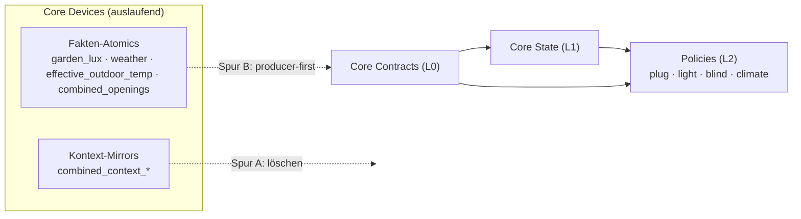

# Fleet-Zielweg: Zielarchitektur & Migrationspfad für alle Integrationen

**Stand:** 2026-08-02 · **Status:** Vorschlag zur Vereinbarung (noch nicht in GitHub definiert, keine Umsetzung) · **Quelle:** ausschließlich GitHub `Levtos`/`main`

> Dieses Dokument baut auf dem Architektur-Audit auf und legt für **jede** aktive Integration einen Zielweg fest, inkl. der Ablösung Core Devices → Core Contracts. Am Ende: konsolidierte offene Entscheidungen (Benni) und ein Vorschlag, wie der vereinbarte Weg in GitHub verankert wird.

---

## 0. Entscheidungs-Update (2026-08-02, Benni)

Vier Entscheidungen getroffen; sie überschreiben die betroffenen Punkte in §6/§8:

- **Außentemperatur (war §6.2):** *Rohfakt L0 + globaler L1-Wert.* Core Contracts liefert **temperature, humidity, wind, sun** als Fakten; **Core State** berechnet daraus **einmal zentral** einen `thermal_context` bzw. `effective_outdoor_temperature` (Name bewusst **nicht** „gefühlte Temperatur"). Blind **und** Climate konsumieren diesen einen Wert; Climate ergänzt heiz-spezifische feels-like/Forecast **obendrauf**.
- **Wake-Floor / Tagesphase (war §6.3):** **`early_morning` ≠ Sonnenaufgang ≠ persönlicher Wake-State.** Eine **06:00-Grenze für Wake-Entscheidungen** ist gewünscht und bleibt **unabhängig** von Sonnenaufgang/Tagesphase. Zusätzlich soll das Tagesphasen-Modell auf ein **hybrides, konfigurierbares** Modell geprüft werden (astronomischer Anker + saisonaler Vor-/Nachlauf + absolute früheste/späteste Grenzen; optional manueller Anker/Zeitprofil). „Sonnenaufgang − 3 h" ist **nur Hypothese**. Owner-Frage (Core State vs internes Environment-Modul vs Umwelt-Contract) ist zu klären — Analyse in §3.5.
- **Schlafzustände (war §6.4):** **Ja** — `provisional_sleep`/`inferred_sleep` ergänzen. Bio wird über `sleep|waking|awake` hinaus abgestuft (Spec nötig: Trigger/Übergänge).
- **Spur A Timing (war §6.6):** **Erst mit Gesamtplan** — keine vorgezogene Welle 1. Spur A läuft gebündelt nach ADR/Issue-Definition (§8 angepasst).

---

## 1. Vereinbartes Schichtmodell (das Prinzip)

Vier Schichten, ein Owner pro Wert. Kommunikation ausschließlich über **HA-Entity-/Contract-Grenzen** (kein Cross-Modul-Python-Import — im Fleet bereits durchgehend so).

| Schicht | Rolle | Rechnet? | Owner-Module |
|---|---|---|---|
| **L0 Fakten (Atomic)** | Rohe HA-Entität → normalisieren, **beste Quelle wählen** (Fallback), Freshness/Quality/Evidence taggen. **Keine** Kombination zu neuer Bedeutung. | **Nein** (nur Auswahl/Normalisierung) | **Core Contracts** (Ziel) · Core Devices (Legacy) |
| **L1 Kontext/Fusion** | Aus Fakten **neue globale Zustände ableiten**. Der Rechenkopf. | **Ja** (der einzige Ort für globale Ableitung) | **Core State** (Personen/Zeit/Umwelt) · **Media State** (Medien) |
| **L2 Policy** | Hört auf L1 (+ direkt benötigte L0-Fakten), **entscheidet nur die eigene Domäne** inkl. Schwellen. | Nur Domänen-Entscheidung | blind/climate/light/door/plug/media/notification |
| **L3 Apply/Render** | Führt Entscheidung idempotent aus / rendert. Baut keine Wahrheit nach. | Nein | media_apply · scene_presets · (policy-interne Apply-Coordinators) |

**Kernregel (dein Maßstab):** *Core Contracts rechnet nichts.* Alles, was Interpretation/Kombination erfordert (is_hot, solar_load, Bio, Presence, Tagesphase, Saison, Activity), ist L1 = **Core State**. Alles, was nur „vertrauenswürdiger aktueller Rohwert" ist (Temp, Lux, Sonne, Wetter, Opening, Lock), ist L0 = **Core Contracts**.

**Litmus-Test pro Wert:**
1. Erfordert er Rechnung/Interpretation? → **nein**: L0 Core Contracts · **ja**: weiter zu 2.
2. Braucht ihn je ein zweiter Konsument (global wiederverwendbar)? → **ja**: L1 Core State (bzw. Media State) · **nein** (nur für die eine Aktuierung): bleibt in der L2-Policy.

---

## 2. Fleet-Rollenkarte (Ziel)

| Integration | Schicht heute (Registry) | Ziel-Rolle | Zielweg-Kurz |
|---|---|---|---|
| `benni-core-contracts` | Foundation | **L0 Fakten-Owner** (Ziel) | Fakten-Scope erweitern (Umwelt/Sonne), producer-first, Shadow→Published |
| `benni-core-devices` | Foundation (legacy) | **auslaufend** | Zwei-Spur-Ablösung (§4), dann `archive-candidate` |
| `benni-core-state` | Foundation | **L1 Orchestrator** (Personen/Zeit/Umwelt) | Rechenkopf; +Saison/Theme +Solar-/Heat-Kontext; konsumiert L0-Fakten |
| `benni_media_state` | Context/media | **L1 Medien-Owner** | bleibt; einzige Medienwahrheit |
| `Title_classifier` | Context/media | **L0/Feeder für Media** | bleibt; Enum-Fakt für media_state |
| `benni_media_context` | Context/media | **Legacy (Split-Ursprung)** | wird in media_state (L1) + media_policy (L2) aufgelöst → dann retire |
| `benni_media` | Context/media | **UX-Umbrella** | bleibt; Panel über state/policy/apply |
| `benni_blind_policy` | Policy | **L2** | Umwelt-Fakten aus L0, Opening `opening.v1`, Kontext aus core_state; heat/glare-**Schwellen** bleiben |
| `benni_climate_policy` | Policy | **L2** | Außentemp als **Fakt** aus L0 (Doppel-Ingestion beenden); Heiz-Domäne bleibt |
| `benni_light_policy` | Policy | **L2** | Saison/Theme + Lux aus L1/L0 statt hardcodiert; `look`-Matrix bleibt |
| `benni_door_policy` | Policy | **L2** | Presence aus core_state (Slug vereinheitlichen); Opening-Fakt optional |
| `plug_policy_engine` | Policy | **L2** | Kontext von core_devices-Mirrors → **core_state direkt** re-pointen |
| `benni_media_policy` | Policy | **L2** | Logik aus media_context fertig extrahieren; konsumiert media_state |
| `benni_notification_router` | Policy/Router | **L2 (cross-cutting)** | bleibt; konsumiert core_state + media_state + L0-Fakten |
| `benni_media_apply` | apply | **L3** | bleibt; Referenzmuster „Policy denkt, Apply tut" |
| `benni_scene_presets` | Render | **L3 Render** | bleibt; kennt keinen Zustand, rendert `look` |
| `ha_wake_planner` | Render/utility | **Seiten-Planer (separat)** | bleibt separat; nur Zukunftsplanung; Zyklus-Guardrail |
| `discord-game` · `stash-ha` · `Media_Art_Wrapper` | Render/utility | **periphere Feeder** | liefern Roh-/Medien-Signale; kein State-Ownership; später als L0-Quellen an Core Contracts/Media anbinden |

---

## 3. Per-Integration Zielweg

### L0 — Fakten

**`benni-core-contracts` (Ziel-Owner L0).** Heute: Signalgraph, Shadow-only, 1 Published-Pilot (`sensor.benni_opening_kitchen_patio_door`), Schemata opening/lock/cover/activity(primitiv)+temp/humidity.
→ **Ziel:** Fakten-Scope erweitern um **Umwelt/Sonne** (`outdoor_temperature`, `weather_condition`, `illuminance/lux`, `sun_elevation`, `sun_azimuth`, `sunrise/sunset`, `is_daylight`). Bleibt reine Normalisierung + Quellenauswahl, **keine** Ableitung. **Producer-first:** publiziert Fakten im Shadow, Published nur per Allowlist/Gate (`#1`).

**`benni-core-devices` (auslaufend).** Heute realer Owner zweier Entity-Klassen (siehe §4). → **Ziel:** Zwei-Spur-Ablösung, danach `archive-candidate` (eigener Issue, Bennis Gate). Keine neuen Combineds/Aliase (`core-contracts#1`).

**`Title_classifier` (L0-Feeder Media).** Heute: v3 (Postgres LXC 108), liefert stabilen Enum aus Titeln/Apps. → **Ziel:** bleibt spezialisierter Fakten-/Enum-Feeder **für media_state**. Konsumenten lesen media_state, nicht TC direkt (Idle-Sentinel-Contract beachten). Kein Umbau.

### L1 — Kontext/Fusion

**`benni-core-state` (L1 Orchestrator).** Heute: presence*, bio_state, day_state, day_context, activity_state, master_context; konsumiert wake_needed/next_wake (Wake Planner), einen media_state-Feed, solar_noon.
→ **Ziel (additiv):**
- **+ Ambient-Sub-Domäne** (§3.5): `thermal_context`/`effective_outdoor_temperature` (aus temp/humidity/wind/sun), `solar_load`-Bänder, Saison/Theme; profil-/standortgebunden, eigener `*_ambient_*`-Namespace; Strangler-extrahierbar zu `benni_environment_state`.
- **+ Saison/Theme** (FAHRPLAN B3) — löst Light-Hardcoding.
- **Umwelt-Fakten aus L0 konsumieren** statt roh (sun.sun → sun_elevation/azimuth-Fakt).
- **Bio-Wake vom `day_state` entkoppeln** → absolute konfigurierbare früheste Weckzeit (Default 06:00), unabhängig von Sonnenaufgang/Tagesphase (§3.5).
- **+ `provisional_sleep`/`inferred_sleep`** ergänzen (abgestufte Schlafzustände; Trigger-Spec nötig).
- Optional: `wake_confirmed`/`wake_candidate`/Signalstärke als Attribute exponieren.
- Bio bleibt Owner von sleep/waking/awake (+neue Stufen); Wake Planner liefert weiter nur `wake_needed`/`next_wake`.

**`benni_media_state` (L1 Medien).** Heute: Owner von media_context/gaming_source/Buckets/entertainment_active, Activity-Feed für core_state, leitet Away aus presence_personal ab. → **Ziel:** bleibt einzige Medienwahrheit; keine Verlagerung. Grenze zu core_state (ein Feed, keine Roh-Reads) ist Soll und erfüllt.

**`benni_media_context` (Legacy).** Split-Ursprung von media_state+media_policy. → **Ziel:** nach Abschluss der Extraktion (media_policy Step 2/3) **retire**; bis dahin keine neuen Konsumenten.

### 3.5 Umwelt-/Ambient-Ownership & Wake-Decoupling (vertieft, aus §0-Entscheidung)

**Ist-Modell `day_state` (belegt, `logic.py::compute_day_phase_starts`):** die Morgen-/Nachtkanten sind **feste Uhrzeit-Anker** (`early_morning = 04:13 − saisonaler Offset`, `early_night = 23:18 + Offset`; Offset max ±15 min); nur die Mittagsachse (`afternoon`) hängt am realen `solar_noon`; `forenoon = noon−3h`, `early_evening = noon+4h`, late_morning/late_evening über Monats-Splitfaktoren. → `early_morning` startet also **~04:13**, **nicht** am Sonnenaufgang. Für einen 06:00-Aufsteher ist es um 06:00 längst `early_morning`/`late_morning` — die Tagesphase ist **nicht** das Problem.

**Das eigentliche Kopplungsproblem:** Der Bio-Wake-Gate `wake_indicators_allowed(day_state)` erlaubt Wecken, sobald `day_state` **nicht** Nacht ist — also ab ~04:13. Damit könnte ein Indiz (Kaffee/PS5) schon ~04:30 auf `awake` kippen. **Fix (§0-Entscheidung):** Bio-Wake-Gate von `day_state` **entkoppeln** und durch eine **absolute, konfigurierbare früheste Weckzeit (Default 06:00)** ersetzen. `day_state` bleibt reiner **Ambient-Ausgang** (für Policies/UX), ist **nicht** der Personen-Wake.

**Hybrides Tagesphasen-Modell (zu bewerten, Hypothese):** statt fixem 04:13/23:18 → `phase_start = clamp(astronomischer_Anker ± saisonaler_Offset, frühestens, spätestens)`. Astronomischer Anker (Dämmerung/Sonnenaufgang/Sonnenhöhe) als **Fakt aus L0**; Offset + absolute Grenzen + optionaler manueller Anker/Zeitprofil als **Config** im Ambient-Owner. Vorteil: reales Tracking ohne pathologischen Winter-Drift (23.12. Dämmerung ~07:40 würde `early_morning` sonst zu spät legen — die Clamp-Untergrenze verhindert das). Konkrete Anker/Grenzen sind **Spec-Entscheidung**, nicht hier entschieden.

**Owner der Umwelt-/Ambient-Ableitung (day_state · season/theme · thermal_context · solar_load):**
- **Fakten** (temp/humidity/wind/sun_elevation/azimuth/sunrise/dawn/lux/weather) → **L0 Core Contracts** (rechnet nicht).
- **Ableitung** → **L1**, ein Owner. **Core Contracts scheidet aus** (würde rechnen).
- **Empfehlung:** als **profil-/standortgebundenes Ambient-Sub-Modul** — Umwelt ist *pro Standort* (Benni-Wohnung ≠ Eltern-Haus, andere Geo/Sonne), das passt exакt auf das bestehende **Profil-Modell von Core State**. Daher **zunächst intern in Core State** mit eigener, profil-gebundener **Ambient-Entity-Namespace** (`sensor.<profil>_ambient_*`), sauber abgegrenzt und **später per Strangler zu `benni_environment_state` (L1-Geschwister) extrahierbar**, falls die astronomische/Config-Logik wächst. Begründung: „kein unnötiger dritter State-Kopf" (deine Regel) + Extraction-Playbook (erst intern, extrahieren wenn es einen Repo verdient) + ein Owner, keine Doppelberechnung.
- **Verbleibende Gabelung (Benni):** *intern in Core State* (Empfehlung) **vs.** *eigene `benni_environment_state`-Integration von Anfang an* (verteidigbar wegen Config-Schwere + Domänentrennung Person/Medien/Umwelt). Kein Merge in Core Contracts.

**Konsequenz für §5/D4/D5:** thermal_context + solar_load werden **einmal** im Ambient-Owner gerechnet; blind/climate/light konsumieren, re-derivieren nicht. `day_state` bleibt dort, wird aber vom Personen-Bio entkoppelt.

### L2 — Policies

**`benni_blind_policy`.** Heute: core_state (bio/day/day_context/presence_household, **clean slug**) + core_devices (opening `benni_combined_openings`, lux `benni_device_garden_lux`, weather `benni_device_weather_condition`, outdoor_temp `benni_combined_climate_effective_outdoor_temperature`) + media_state + **`sun.sun` roh**. Rechnet heat/glare selbst.
→ **Ziel:** Umwelt-Fakten (temp/lux/sun/weather) aus **L0 Core Contracts**; Opening auf **`opening.v1`** (Issues #4/#8); grober Solar-Kontext aus **L1 core_state**; heat/glare-**Schwellen bleiben in der Policy** (Issue #9); Activity als Contract (Issue #10) aus core_state.

**`benni_climate_policy`.** Heute: eigener Weather Resolver ingestiert `weather.dwd_home` roh, rechnet „effektive Außentemperatur"/feels-like.
→ **Ziel:** rohe/effektive Außentemp als **Fakt aus L0** beziehen (beendet Doppel-Ingestion D1); heiz-spezifische Antizipation (Forecast+3h, feels-like-für-Heizen) bleibt **Domäne** — aber auf dem geteilten Fakt aufsetzend, nicht als zweite Rohquelle. Issues #24/#26 mit GitHub-Substanz füllen.

**`benni_light_policy`.** Heute: core_devices env-atomics (garden_lux, weather_season_meteorological), day_context via **core_devices-Combined**; Saison/Theme hardcodiert.
→ **Ziel:** Saison/Theme aus **L1 core_state** (neuer Theme-Kontext); Lux aus L0; day_context aus core_state; `theme×phase→look`-Matrix bleibt. `look`-Rendering an scene_presets.

**`benni_door_policy`.** Heute: `sensor.system_benni_core_state_presence_effective` (**system_ slug**) + raw_presence-Attribut.
→ **Ziel:** bleibt; Presence aus core_state (kanonische Entity-ID vereinheitlichen, §6 D7); optional Opening-Fakt (`opening.v1`) und lock_battery als L0-Fakt. Sicherheitsregeln (nur lock/unlock, kein open) unangetastet.

**`plug_policy_engine`.** Heute: Kontext aus **core_devices-Mirrors** (`benni_combined_context_presence_personal|bio_state|day_state|activity_state`) + media_state.
→ **Ziel:** Kontext-Inputs **direkt auf core_state re-pointen** (Track A, §4); Media aus media_state (erfüllt); Policies AO/HB/AC/SC/CS + `kind`-Sonderlogik bleiben Domäne. Domain-Slug `plug_policy_engine` bleibt (Contract-Stabilität).

**`benni_media_policy`.** Heute: 0.1.0 Scaffold, Logik noch nicht portiert.
→ **Ziel:** Volume/Owner/Ducking-Logik aus media_context extrahieren (Step 2/3); konsumiert media_state (+ ggf. core_state private_time/presence); Volume-Matrix-Schwellen bleiben Domäne.

**`benni_notification_router` (cross-cutting).** Heute: konsumiert bio/activity/presence (core_state), media_context (media_state), opening_safety, lock_battery, headset/quiet. Reine `routing.decide`.
→ **Ziel:** bleibt; Vorbild „L2 hört auf zentrale Zustände". Opening_safety/lock_battery mittelfristig aus L0-Fakten. Keine eigene Zustandsberechnung.

### L3 — Apply/Render

**`benni_media_apply`.** Executor; konsumiert media_state + media_policy per Entity-State, idempotenter Apply, shadow-gated. → **Ziel:** bleibt, Referenzmuster. Keine Änderung am Ownership-Modell.

**`benni_scene_presets`.** Render-/Library-Layer; „kennt keine Presence/Activity/Day-Phase". light_policy ruft `apply_look(slug)`. → **Ziel:** bleibt; saubere Trennung bereits erfüllt.

### Seiten-Planer & periphere Feeder

**`ha_wake_planner`.** Reiner Zukunftsplaner (next_wake/wake_state/wake_needed/Event). → **Ziel:** bleibt separat. **Guardrail:** darf **nicht** core_state-Presence in den Planungspfad ziehen, der core_state wieder konsumiert (Zyklus). Presence-Skip bleibt externe Automation oder core_state-seitig.

**`discord-game` · `stash-ha` · `Media_Art_Wrapper`.** Periphere Roh-/Medien-Quellen. → **Ziel:** kein State-Ownership; sie sind L0-Quellen, die mittelfristig als SourceBindings an Core Contracts (Fakt) bzw. als Roh-Eingang an media_state hängen. Kein Umbau in dieser Welle.

---

## 4. Core Devices → Core Contracts: Zwei-Spur-Ablösung

Core Devices exponiert heute **zwei verschiedene Entity-Klassen**, die auf **getrennten Spuren** ablösen — das ist der Schlüssel für ein sicheres Retirement:

### Spur A — Kontext-Mirrors (schnell, risikoarm, kein neuer Producer nötig)
`sensor.benni_combined_context_presence_personal | _bio_state | _day_state | _day_context | _activity_state` sind **Spiegel** von core_state-Zuständen (L1). core_state ist bereits der Rechenkopf.
→ **Weg:** Konsumenten (plug, light, ggf. weitere) **direkt auf core_state** re-pointen; Mirror-Combineds löschen. **Kein** core_contracts nötig — reine Consumer-Umverdrahtung. Löst Doppelwahrheit D2/D6.

### Spur B — Fakten-Atomics (langsamer, gated, producer-first)
`sensor.benni_device_garden_lux`, `sensor.benni_device_weather_condition`, `sensor.benni_device_weather_season_meteorological`, `sensor.benni_combined_climate_effective_outdoor_temperature`, `sensor.benni_combined_openings` / `…_opening_unsafe_for_rollo`.
→ **Weg:** Core Contracts publiziert die entsprechenden **Fakten** (Umwelt/Opening) → Shadow-Vergleich → Consumer-Cutover (blind/climate/light) → Atomics löschen. **Producer-first**, gated durch `core-contracts#1`. Löst D1/D4/D5.

**Ergebnis:** Wenn Spur A + Spur B durch sind, hat Core Devices keine aktiven Konsumenten mehr → `archive-candidate` (eigener Issue, Bennis Gate). Spur A kann **sofort** laufen; Spur B hängt am core_contracts-Published-Gate.

---

## 5. Konkurrierende Wahrheiten → Zielauflösung

| # | Wert | Heute doppelt | Ziel-Owner | Spur |
|---|---|---|---|---|
| D1 | effective outdoor temperature | core_devices-Combined **+** climate-intern | **L0 Core Contracts** (Fakt), climate baut darauf | B |
| D2/D6 | presence/bio/day/activity **Kontext** | core_state **+** core_devices-Mirror `combined_context_*` | **L1 Core State** | A |
| D3 | Activity (abgeleitet) | core_state Fusion vs core_contracts „Activity-Contract" | **L1 Core State** (Core Contracts nur rohes Primitiv) | — (Prinzip) |
| D4 | heat/glare/solar load | je Policy neu | **L1 Core State** (grob) + Policy (Schwelle) | B |
| D5 | Sonnen-Geometrie | `sun.sun` roh verteilt | **L0 Core Contracts** (Fakt) | B |
| D7 | kanonische Presence-Entity | `system_…presence_effective` (door) vs `benni_core_state_*` (blind) | **eine** kanonische Contract-Entity-ID | A (Naming) |

---

## 6. Offene Entscheidungen (Benni)

> Jede mit meiner Empfehlung. „Prinzip-geklärt" = durch „Core Contracts rechnet nichts" bereits beantwortet, nur Bestätigung nötig.

**✅ Entschieden (2026-08-02):**
- **Außentemperatur:** L0-Fakten (temp/humidity/wind/sun) → **einer** `thermal_context`/`effective_outdoor_temperature` in L1 core_state → blind+climate teilen ihn; climate ergänzt Heiz-feels-like/Forecast obendrauf.
- **Wake-Floor:** absolute **06:00-Grenze (konfigurierbar)** für Wake, **entkoppelt** von Sonnenaufgang/`day_state`.
- **Schlafzustände:** `provisional_sleep`/`inferred_sleep` **werden ergänzt**.
- **Spur A:** läuft **gebündelt mit dem Gesamtplan**, keine vorgezogene Welle.

**⏳ Noch offen:**
1. **Activity-Ownership** — **Empfehlung:** `activity_state`-Fusion = **Core State**; Core Contracts höchstens rohes Geräte-Aktivitäts-Primitiv. *(Prinzip-geklärt — bestätigen; Widerspruch zu `core-contracts#1`-Wortlaut auflösen.)*
2. **Ambient-Owner (§3.5)** — *intern in Core State* (Empfehlung, profil-/standortgebunden, Strangler-extrahierbar) **vs.** *eigene `benni_environment_state`-Integration von Anfang an*. **Echte Gabelung.**
3. **Tagesphasen-Modell (§3.5)** — hybrides Modell (astronomischer Anker + saisonaler Offset + absolute Grenzen + optionaler manueller Anker) *bewerten & Spec festlegen*: welcher Anker (Dämmerung/Sonnenaufgang/Sonnenhöhe), welche Clamp-Grenzen? *(Design-Spec.)*
4. **`provisional_sleep`/`inferred_sleep`-Spec** — Trigger & Übergänge definieren (was löst provisional vs inferred vs confirmed aus?). *(Fachliche Spec.)*
5. **Solar-/Heat-/Bright-Bänder** — konkrete Bänder (`solar_load` low/mid/high? `is_hot_outside`? `outdoor_bright`?), die blind+climate+light teilen. *(Design; Vorschlag → Bestätigung.)*
6. **Kanonische Entity-IDs (Slug)** — `system_`-Präfix vs cleaner Slug inkonsistent (door vs blind). **Empfehlung:** eine kanonische Contract-Entity-ID pro L1-Wert festschreiben, an stabile bestehende Quelle gebunden. *(Contract-relevant.)*
7. **Governance-Lücke** — `control#2/#7`, `blind#4`, `climate#24` sind GitLab-Platzhalter ohne GitHub-Substanz → Inhalt auf GitHub rekonstruieren, bevor darauf gebaut wird. *(Muss, ADR 0002.)*

---

## 7. Vorschlag: so verankern wir den Weg in GitHub (nicht ausgeführt)

Nach deiner Zustimmung (und Auflösung §6), als **eigener, sauber gebranchter** Schritt mit Live-Gate bei dir:

1. **ADR in `control/docs/adr/`** — „State-Ownership & Fleet-Layer-Modell" (das §1-Prinzip + §5-Auflösungen als Entscheidung). Ergänzt/verweist ADR 0002.
2. **`control/docs/contracts/`** — Ownership-Matrix (Audit §4) + diese Rollenkarte (§2) als kanonische Seiten.
3. **Issue-Schnitt** (ein `agent:` pro Issue, ADR 0002):
   - `control`: ADR + Matrix; `control#7`/`#2` mit GitHub-Substanz füllen.
   - `benni-core-contracts`: Umwelt-Fakten-Schemata (Shadow).
   - `benni-core-state`: Theme-Kontext + Solar-/Heat-Bänder; Activity-Ownership pinnen; (opt.) Min-Sleep/provisional_sleep je nach §6.3/6.4.
   - **Spur A**: `plug_policy_engine` + `benni_light_policy` Kontext-Re-Point auf core_state; Mirror-Retirement (`benni-core-devices`).
   - **Spur B** (producer-first): core_contracts Fakten live → `benni_blind_policy`/`benni_climate_policy`/`benni_light_policy` Consumer-Cutover; Opening `opening.v1`.
   - `benni_media_policy`: Extraktion Step 2/3 abschließen; dann `benni_media_context` retire.
   - `ha_wake_planner`: Doku/ADR-Bestätigung + Zyklus-Guardrail.
   - `benni-core-devices`: nach A+B → `archive-candidate` (eigener Issue, Bennis Gate).

---

## 8. Reihenfolge (Wellen)

- **Welle 0 (fachlich):** §6-Restpunkte entscheiden → ADR + Matrix in `control` festschreiben. (Spur A wird **nicht** vorgezogen — Benni-Entscheidung §0.)
- **Welle 1 (Producer-first):** L1 core_state um Ambient-Sub-Domäne (thermal_context, solar_load, Saison/Theme) + Bio-Wake-Decoupling (06:00) + provisional/inferred; L0 core_contracts Umwelt-Fakten (Shadow). Kanonische Slugs (D7) festlegen.
- **Welle 2 (Consumer-Cutover, gebündelt):** Spur A (Kontext-Mirrors → core_state) **und** Spur B (blind/climate/light auf L0-Fakten + L1-Kontext; Opening `opening.v1`) zusammen. Pro Consumer Shadow→Live (Bennis Gate).
- **Welle 3 (Aufräumen):** media_policy-Extraktion fertig, media_context retire; core_devices → archive-candidate; alte Doppelberechnungen entfernen.

Jede Welle: Shadow-/Regressionsvergleich vor Cutover; `Testing`≠`Live`; Live-Gate bleibt bei Benni.